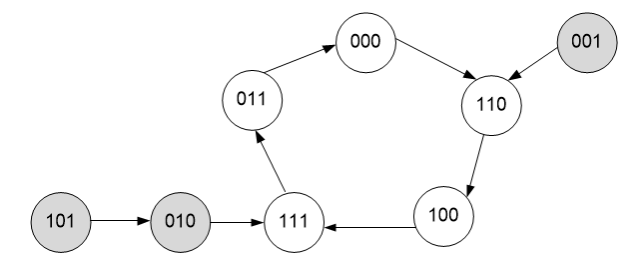
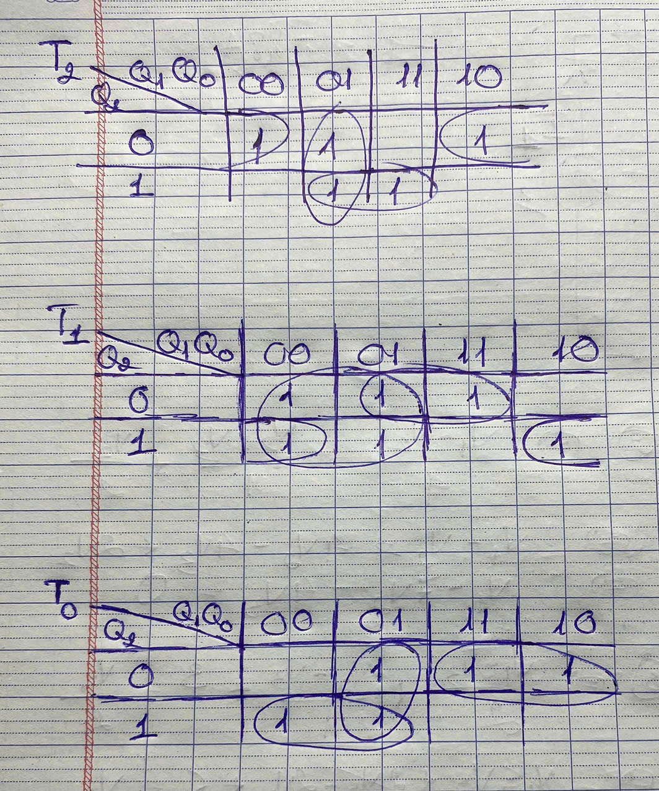
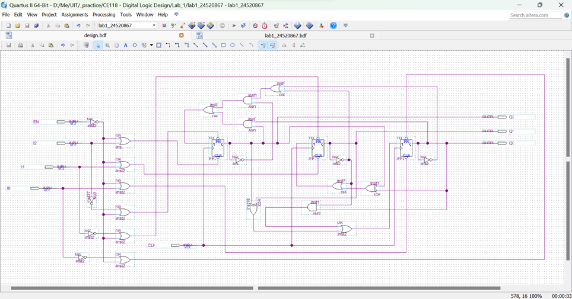
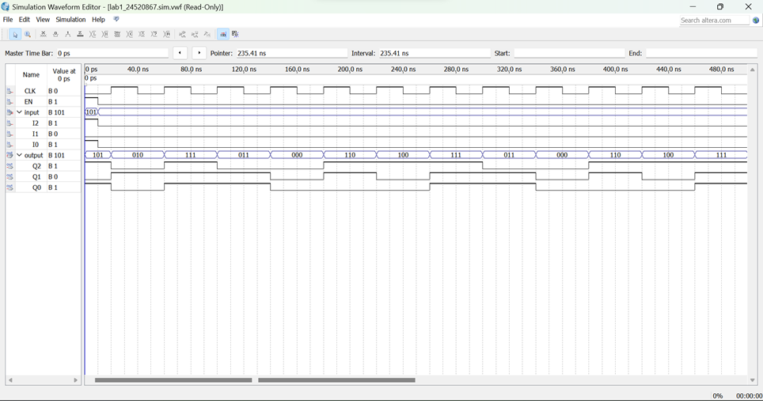
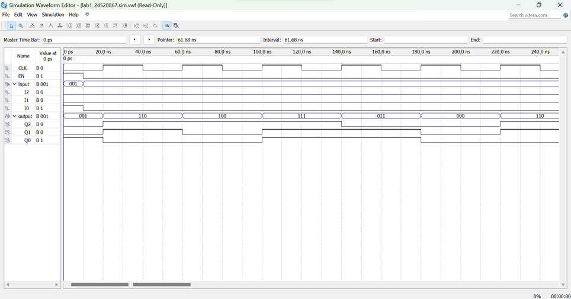
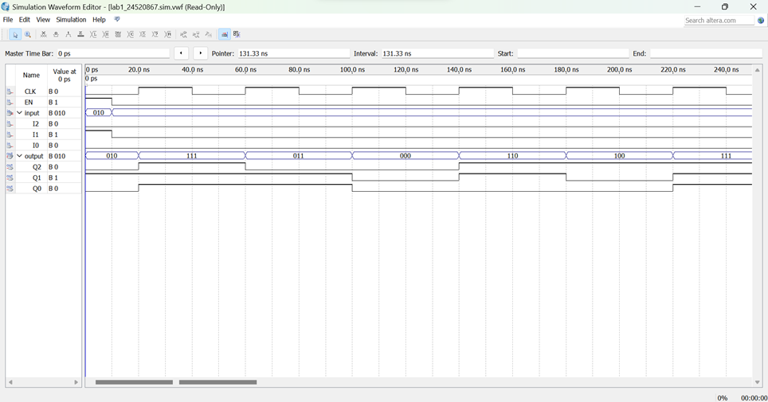

# Lab 1 — Thiết kế mạch đếm đồng bộ có khả năng nạp giá trị ban đầu

## Đề bài
Sử dụng FF-T để thiết kế một mạch đếm đồng bộ có chu trình đếm như sau:  

- Các state màu xám nằm ngoài chu trình.
- Mạch cần có khả năng nạp bất đồng bộ để người dùng nạp giá trị ban đầu vào bộ đếm.  
- Chỉ mô phỏng trên Quartus, không nạp thiết kế lên Kit DE2.

## Mục tiêu lab 
Trong bài lab này, mình sẽ ôn lại cách thiết kế và mô phỏng một mạch đếm đồng bộ theo một chu trình đếm cho trước trong phần mềm Quartus.

## Mình đã làm gì?
### 1. Bảng kích thích và bảng chuyển trạng thái
**Bảng kích thích:**
- Bảng kích thích cho biết giá trị tương ứng của input để output có thể chuyển từ giá trị hiện tại sang giá trị chỉ định. 
- Nguyên lý hoạt động của FF-T là: T = 0 thì Q giữ nguyên; T = 1 thì Q đảo giá trị.
- Từ 2 điều trên, ta rút ra được bảng kích thích của FF-T như sau:

| Q | Q+ | T |
|:-------:|:-------:|:-------:|
| 0 | 0 | 0 |
| 0 | 1 | 1 |
| 1 | 0 | 1 |
| 1 | 1 | 0 |

Với Q+ là giá trị (mong muốn) của Q tại xung clock kế tiếp.

**Bảng chuyển trạng thái:**
- Như ta đã thấy trong sơ đồ, mạch đếm này cần biểu diễn 8 giá trị khác nhau. Vậy, số FF-T mà ta cần dùng sẽ là: **3**.
- Với Q2, Q1, Q0 lần lượt là từng bit của giá trị output, ta lập được bảng chuyển trạng thái từ sơ đồ trạng thái bên trên như sau:

| Q2 | Q1 | Q0 | Q2+ | Q1+ | Q0+ |
| :---: | :---: | :---: | :---: | :---: | :---: |
| 0 | 0 | 0 | 1 | 1 | 0 |
| 0 | 0 | 1 | 1 | 1 | 0 |
| 0 | 1 | 0 | 1 | 1 | 1 |
| 0 | 1 | 1 | 0 | 0 | 0 |
| 1 | 0 | 0 | 1 | 1 | 1 |
| 1 | 0 | 1 | 0 | 1 | 0 |
| 1 | 1 | 0 | 1 | 0 | 0 |
| 1 | 1 | 1 | 0 | 1 | 1 |

- Kết hợp với bảng kích thích của FF-T bên trên, ta có bảng kích thích của cả 3 FF-T như sau:

| Q2 | Q1 | Q0 | Q2+ | Q1+ | Q0+ | T2 | T1 | T0 |
| :---: | :---: | :---: | :---: | :---: | :---: | :---: | :---: | :---: |
| 0 | 0 | 0 | 1 | 1 | 0 | 1 | 1 | 0 |
| 0 | 0 | 1 | 1 | 1 | 0 | 1 | 1 | 1 |
| 0 | 1 | 0 | 1 | 1 | 1 | 1 | 0 | 1 |
| 0 | 1 | 1 | 0 | 0 | 0 | 0 | 1 | 1 |
| 1 | 0 | 0 | 1 | 1 | 1 | 0 | 1 | 1 |
| 1 | 0 | 1 | 0 | 1 | 0 | 1 | 1 | 1 |
| 1 | 1 | 0 | 1 | 0 | 0 | 0 | 1 | 0 |
| 1 | 1 | 1 | 0 | 1 | 1 | 1 | 0 | 0 |

### 2. Phương trình ngõ vào FF-T
- Từ bảng kích thích 3 FF-T như trên, ta dùng bìa Karnaugh và tìm ra được phương trình ngõ vào cho từng FF dựa theo output của chúng như sau:
  - **T2** = Q2’.(Q1’ + Q0’) + Q2Q0
  - **T1** = Q1’ + (Q0 ⊕ Q2)
  - **T0** = (Q2 ⊕ Q1) + Q1’.Q0

### 3. Mạch load bất đồng bộ
- Với các phương trình ngõ vào đã xây dựng ở mục (2), ta chỉ mới có một mạch đếm qua các giá trị theo đúng sơ đồ đã cho - người dùng chưa thể nạp giá trị ban đầu vào mạch này.
- Để làm được điều đó, ta phải thiết kế sao cho mạch có khả năng nạp giá trị bất đồng bộ thông qua 2 chân PRE và CLR (tích cực mức thấp) của mỗi FF-T, tức output của từng FF-T chỉ phụ thuộc vào đúng 2 ngõ vào bất đồng bộ này, không phụ thuộc vào input T và xung clock nữa.
- Ngoài ra, ta còn có thêm một input mới: Tín hiệu điều khiển EN:
  - Khi EN = 1: mạch được phép nạp giá trị bất đồng bộ - lúc này chỉ PRE và CLR mới ảnh hưởng đến Q như đã nói,
  - Khi EN = 0: mạch không được phép nạp giá trị bất đồng bộ - lúc này Q lại quay về phụ thuộc vào T và xung clock.
- Từ những điều trên, ta viết được bảng chân trị của 2 tín hiệu PRE và CLR của 1 FF-T dựa vào tín hiệu điều khiển EN và giá trị cần nạp vào FF đó I như sau:

| EN | I | PRE | CLR |
| :---: | :---: | :---: | :---: |
| 0 | 0 | 1 | 1 |
| 0 | 1 | 1 | 1 |
| 1 | 0 | 1 | 0 |
| 1 | 1 | 0 | 1 |

- Giải thích:
  - Các tín hiệu PRE và CLR này là loại **tích cực mức thấp**, tức là khi PRE = 0 thì Q mới được set, và khi CLR = 0 thì Q mới bị clear *(trạng thái cấm là PRE = CLR = 0 - không thể vừa set vừa clear cùng lúc)*.
  - Khi EN = 0 thì mạch không được nạp giá trị bất đồng bộ, nên cả PRE và CLR đều phải bằng 1 để không ảnh hưởng đến Q.
  - Khi EN = 1 thì mạch được phép nạp giá trị bất đồng bộ. Lúc này, ta xét giá trị cần nạp vào I. I bằng bao nhiêu thì Q phải bằng bấy nhiêu *(vì ta đang cần nạp I vào FF mà)*, từ đó suy ra được cặp giá trị PRE-CLR tương ứng.
- Từ đó, ta có biểu thức ngõ vào cho PRE và CLR của từng FF:
  - **PRE**: EN’ + I’
  - **CLR**: EN’ + I
- Lưu ý là vì mạch của ta đang dùng 3 FF-T, nên "nạp giá trị bất đồng bộ vào FF" nghĩa là ta sẽ có 3 input mới I2, I1, I0 để nạp từng giá trị vào FF2, FF1, FF0 tương ứng.

### 4. Vẽ mạch trên Quartus
Từ phương trình của tất cả ngõ vào T, PRE, CLR của mỗi FF, ta vẽ được mạch hoàn chỉnh như sau:  

## Kết quả mô phỏng
- Thiết lập chu kỳ của tín hiệu CLK là 40ns.
- Nhóm các tín hiệu I2-I1-I0 và Q2-Q1-Q0 lại để theo dõi input và output dưới dạng state của chu trình đếm.
- Kiểm thử với giá trị nạp vào ban đầu là 101.

Ta thấy mạch tuân theo chính xác chu trình đếm đã cho: Từ state ngoài 101 -> 010 -> state trong 111 -> 011 -> 000 -> 110 -> 100 -> lặp lại 111 -> ...

- Thử thêm với 2 trường hợp state ngoài chu trình khác:  
**001:**  
  
**010:**  
  

Ta thấy trạng thái của mạch đều đi theo đúng chu trình đã cho.

## Khó khăn và cách giải quyết
| Khó khăn | Cách giải quyết |
|-------|-------|
| Kết quả của "Start Analysis & Synthesis" báo lỗi vì project chưa có top-level entity | Thêm top-level entity dùng symbol của các mạch cấp dưới làm module |
| Mạch chuyển trạng thái sai (110 sang 101 thay vì sang 100, và làm sai luôn cả chuỗi chuyển trạng thái sau đó) | Sửa lại gần như cả cột T0 trong bảng kích thích (sai giá trị rất nhiều), viết lại phương trình input và vẽ lại mạch logic mới cho T0 |
| Lỗi biên dịch vì trùng tên cổng trong thiết kế | Kiểm tra và đổi lại tên các cổng trùng tên |
| Tín hiệu input chỉ duy trì trạng thái ban đầu đã set trong đúng 1/4 chu kỳ đầu tiên, sau đó bị kéo về 0 hết | Nhấn vào tín hiệu để set giá trị trong suốt thời gian mô phỏng, thay vì chỉ 1/4 chu kỳ đầu tiên |

## Mình đã học được gì?
- Entity là một thiết kế hoàn chỉnh, được đóng gói lại để làm thành phần cho một entity cấp cao hơn (trừ top-level entity). Một thiết kế Quartus sẽ có nhiều entity với các cấp bậc khác nhau.
- Trong các entity đã thiết kế, phải có một entity trùng tên hoàn toàn với top-level entity đã khai báo - tức entity đó chính là top-level. Nếu project không có bất cứ top-level entity nào, trình biên dịch sẽ báo lỗi.
- File .vwf chỉ có hiệu lực với một phiên bản thiết kế tại một thời điểm. Nếu sau đó mạch thay đổi, ta phải tạo lại file .vwf mới tương ứng để mô phỏng hành vi của nó.
- Để ý kĩ trạng thái của các tín hiệu tại các thời điểm khác nhau khi mô phỏng.
- Luôn kiểm tra lại bảng kích thích và bảng chuyển trạng thái trước khi vẽ bìa Karnaugh để tìm phương trình ngõ vào.

<!--

## Bài tập thêm
Thực hiện lại chu trình đếm trên với chức năng Load nạp giá trị ban đầu song song đồng bộ.

Xem tại [Lab 1 - Bài tập thêm](<../Lab_1 - extra exercise/>)

-->